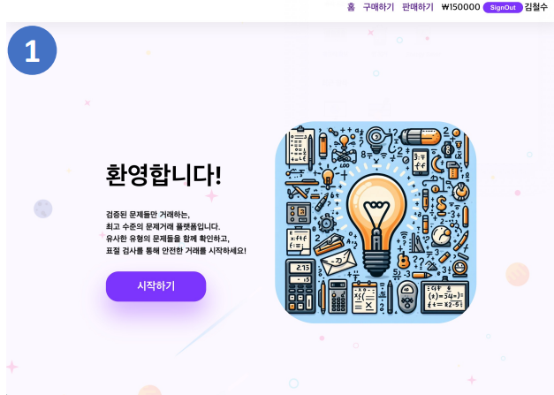

## 🔎 프로젝트 소개  

위 프로젝트는 다음과 같은 배경에서 진행되었습니다.

- 한국 교육시장에서 수학은 중요한 분야 중 하나입니다.
- 이에 따라 수학 문제 거래의 수요 증가하고 있습니다.
- 하지만 인터넷 상에서 출처가 불분명한 문제들이 거래되는 사례도 늘어나고 있습니다.
- 수학 문제 출처가 불분명하여 문제 거래가 악용될 가능성이 있으므로 이를 해결하고자 합니다.

<br>

### 1. 프로젝트 기간
 **2023.11.01 ~ 2024.01.19**

<br>

### 2. 포함 내용
1. 프로젝트 소개
2. 사용 기술 스택
3. 서비스 구조,화면,기능
4. 디렉토리 구조 및 패키지 역할
5. API 구조
6. 기술적 이슈 및 해결 과정
7. 관련 논문
8. 프로젝트 팀원 및 역할
   
<br>

## 🔧 사용 기술 스택

### Backend and DB
- Spring Boot
- MySQL
- FastAPI

### Frontend
- React
- Redux

### AI
- openai 

### Tools
- GitHub


<br>

## 🚀 서비스 구조,화면,기능

### 서비스 구조 


본 서비스는 다음과 같은 구조를 가지며 진행하게 됩니다.
1. 문제 판매자는 문제 사진과 해설지, 가격, 난이도와 같은 정보를 업로드 합니다.
2. 서버에서 사용자의 문제를 받으면 DB에 있는 문제들을 가져옵니다.
3. 이후 사용자가 올린 문제, DB에 있는 문제, 적절한 표절도 판별 프롬프트를 작성하여 LLM 모델이 해당 문제의 표절도와 유사도를 측정하게 합니다.
4. 표절도와 유사도가 측정 완료되면 서버에 문제를 저장한 뒤, 사용자에게 해당 문제의 표절도를 보여주게 됩니다.

<br>

### 메인 화면


1. 사용자는 네비게이션 바를 통해 구매하기 혹은 판매하기를 진행할 수 있습니다.
2. 시작하기 버튼을 누르면 문제를 탐색할 수 있는 페이지로 이동하게 됩니다.


<br>

### 문제 업로드 화면


1. 사용자는 문제의 카테고리를 정할 수 있고, 문제와 해설지 파일을 업로드 할 수 있다.
2. 이후 난이도와 가격의 정보를 정하고 문제를 업로드할 수 있다.

<br>

### 표절도 결과 확인 화면 


1. 위 사진과 같이 사용자가 업로드한 문제에 대해서 표절 수준을 확인할 수 있고, 사용자는 업로드 여부를 결정할 수 있다.

<br>

### 표절 문제 확인 화면


1. 위 사진과 같이 사용자는 어떠한 문제들이 표절 문제인지 확인할 수 있다.

<br>

### 문제 검색 화면


1. 문제를 검색하려는 사용자는 위 사진과 같이 문제 카테고리 별로 검색을 할 수 있다.

<br>

### 문제 구매 화면


1. 사용자는 구매하려는 문제의 표절도를 확인할 수 있고, 구매하기 버튼을 누르면 문제를 구매할 수 있다.
2. 또한 유사도가 높은 문제들을 추천받을 수 있다.

<br>

### 마이페이지 화면


1. 사용자는 마이페이지에서 자신이 구매한 문제를 확인할 수 있다.

<br>

## 📂 디렉토리 구조 및 패키지 역할
### 백엔드 디렉토리
```
root
 ┣ myhomework
 ┃ ┣ complexKey
 ┃ ┃ ┣ MemberComplexKey.java
 ┃ ┃ ┣ ProblemPlagiarizeListPK.java
 ┃ ┃ ┗ ProblemSimilarityListPK.java
 ┃ ┣ controller
 ┃ ┃ ┣ MemberApiController.java
 ┃ ┃ ┣ MemberController.java
 ┃ ┃ ┣ ProblemApiController.java
 ┃ ┃ ┣ ProblemPlagiarizeListController.java
 ┃ ┃ ┣ ProblemSimilarityListController.java
 ┃ ┃ ┗ UserBalanceApiController.java
 ┃ ┣ dto
 ┃ ┃ ┣ DealForm.java
 ┃ ┃ ┣ FileForm.java
 ┃ ┃ ┣ MemberForm.java
 ┃ ┃ ┣ ProblemForm.java
 ┃ ┃ ┣ ProblemPlagiarizeListForm.java
 ┃ ┃ ┣ ProblemSimilarListForm.java
 ┃ ┃ ┗ UserBalanceForm.java
 ┃ ┣ entity
 ┃ ┃ ┣ Member.java
 ┃ ┃ ┣ Problem.java
 ┃ ┃ ┣ ProblemPlagiarizeList.java
 ┃ ┃ ┣ ProblemSimilarList.java
 ┃ ┃ ┗ UserBalance.java
 ┃ ┣ repository
 ┃ ┃ ┣ MemberRepository.java
 ┃ ┃ ┣ ProblemPlagiarizeListRepository.java
 ┃ ┃ ┣ ProblemRepository.java
 ┃ ┃ ┣ ProblemSimilarityListRepository.java
 ┃ ┃ ┗ UserBalanceRepository.java
 ┃ ┣ service
 ┃ ┃ ┣ MemberService.java
 ┃ ┃ ┣ ProblemPlagiarizeListService.java
 ┃ ┃ ┣ ProblemService.java
 ┃ ┃ ┣ ProblemSimilarityService.java
 ┃ ┃ ┗ UserBalanceService.java
 ┃ ┣ .DS_Store
 ┃ ┗ MyhomeworkApplication.java
 ┗ .DS_Store
 
```
1. complexKey : 속성이 2개 이상으로 이루어진 복수키를 관리하기 위한 패키지
2. controller : client로부터 RestAPI요청을 받는 역할을 하는 패키지
3. dto : Reqeust의 형태를 정의하는 패키지
4. entity : JPA에서 데이터베이스의 테이블을 생성하는 역할을 하는 패키지
5. repository : JPA에서 DB와 서버의 연결을 위한 패키지
6. service : 본 서버 프로그램에서 핵심 로직을 처리하는 패키지  

### 프론트엔드 디렉토리 
```
src
 ┣ api
 ┃ ┣ GetAPI.js
 ┃ ┗ PostAPI.js
 ┣ asset
 ┃ ┣ components
 ┃ ┃ ┣ BackButton.js
 ┃ ┃ ┣ background.css
 ┃ ┃ ┣ CategorySelector.js
 ┃ ┃ ┣ ConfirmCancelButton.js
 ┃ ┃ ┣ DetailButton.js
 ┃ ┃ ┣ HeaderBar.js
 ┃ ┃ ┣ index.js
 ┃ ┃ ┣ NextCancelButton.js
 ┃ ┃ ┣ OptionBoxes.js
 ┃ ┃ ┣ PlagiarismModal.js
 ┃ ┃ ┣ PreviewGrid.js
 ┃ ┃ ┣ ProblemPreview.css
 ┃ ┃ ┣ ProblemPreview.js
 ┃ ┃ ┣ SearchButton.js
 ┃ ┃ ┣ SignOutButton.js
 ┃ ┃ ┣ UploadProblemButton.js
 ┃ ┃ ┗ UserName.js
 ┃ ┗ image
 ┃ ┃ ┣ answer_7.PNG
 ┃ ┃ ┣ background_image.PNG
 ┃ ┃ ┣ back_button.png
 ┃ ┃ ┣ intro_image.jpg
 ┃ ┃ ┣ pro_1.PNG
 ┃ ┃ ┣ pro_10.PNG
 ┃ ┃ ┣ pro_11.PNG
 ┃ ┃ ┣ pro_12.PNG
 ┃ ┃ ┣ pro_13.PNG
 ┃ ┃ ┣ pro_14.PNG
 ┃ ┃ ┣ pro_15.PNG
 ┃ ┃ ┣ pro_16.PNG
 ┃ ┃ ┣ pro_17.PNG
 ┃ ┃ ┣ pro_18.PNG
 ┃ ┃ ┣ pro_19.PNG
 ┃ ┃ ┣ pro_2.PNG
 ┃ ┃ ┣ pro_20.PNG
 ┃ ┃ ┣ pro_3.PNG
 ┃ ┃ ┣ pro_4.PNG
 ┃ ┃ ┣ pro_5.PNG
 ┃ ┃ ┣ pro_6.PNG
 ┃ ┃ ┣ pro_7.PNG
 ┃ ┃ ┣ pro_8.PNG
 ┃ ┃ ┣ pro_9.PNG
 ┃ ┃ ┣ search_button.png
 ┃ ┃ ┗ solution_7.PNG
 ┣ page
 ┃ ┣ boughtpage
 ┃ ┃ ┣ BoughtPage.css
 ┃ ┃ ┗ BoughtPage.js
 ┃ ┣ explorepage
 ┃ ┃ ┣ ExploreArticle.css
 ┃ ┃ ┣ ExploreArticle.js
 ┃ ┃ ┣ ExploreHeader.js
 ┃ ┃ ┗ ExplorePage.js
 ┃ ┣ intropage
 ┃ ┃ ┗ IntroPage.js
 ┃ ┣ mainpage
 ┃ ┃ ┣ MainArticle.js
 ┃ ┃ ┣ MainHeader.js
 ┃ ┃ ┗ MainPage.js
 ┃ ┣ mypage
 ┃ ┃ ┗ MyPage.js
 ┃ ┣ problempage
 ┃ ┃ ┣ ProblemDetail.css
 ┃ ┃ ┣ ProblemDetail.js
 ┃ ┃ ┣ ProblemHeader.js
 ┃ ┃ ┗ ProblemPage.js
 ┃ ┗ uploadpage
 ┃ ┃ ┣ UploadArticle.js
 ┃ ┃ ┣ UploadConfirm.css
 ┃ ┃ ┣ UploadConfirm.js
 ┃ ┃ ┣ UploadForm.css
 ┃ ┃ ┣ UploadForm.js
 ┃ ┃ ┣ UploadHeader.js
 ┃ ┃ ┣ UploadPage.js
 ┃ ┃ ┗ UploadWaiting.js
 ┣ store
 ┃ ┣ dataSlice.js
 ┃ ┗ store.js
 ┣ App.css
 ┣ App.js
 ┣ App.test.js
 ┣ index.css
 ┣ index.js
 ┣ logo.svg
 ┣ reportWebVitals.js
 ┣ setupProxy.js
 ┗ setupTests.js
 ```
 1. api : api 처리 관련 디렉토리
 2. asset : 이미지, 폰트, 컴포넌트와 같은 정적파일 및 컴포넌트 파일들로 구성된 디렉토리
 3. page : 각각의 page를 구성하는 파일들로 구성된 디렉토리
 4. store : redux와 관련된 변수들의 상태 관리를 하는 디렉토리
 
<br>

## 📑 API 구조
본 프로젝트의 API 구조는 [여기](https://github.com/LSe-Yeong/PTD/blob/readme/API_README.md)서 확인할 수 있습니다.

<br>

## ✅ 기술적 이슈 및 해결 과정
1. 수학 문제 표절도 판별 프롬프트를 어떤식으로 구성할지?
    - 역할 부여, 정의 명시, 정보 제외, 단계적 분류 총 4가지 단계를 설정하여 프롬프트를 구성하였다.
    - 특히 정의 명시에서 문제의 정보, 풀이과정의 맥락 등 표절의 기준을 명확하게 부여하여 성능을 높였다.
    - 다음은 본 프로젝트의 프롬프트 구성이다.
    

<br>
      
2. 사진 데이터 처리를 어떻게 할지?
    - 문제 업로드 시 사진은 MultipartFile의 형태로 받는다.
    - 이후 File 클래스의 형태로 바꿔준 뒤 LLM 모델에게 전송한다.
    - 표절도 측정 이후 사진 데이터를 프로젝트 패키지의 image 디렉토리에 저장한다.
    - 이후 사진을 조회할 때는 image 디렉토리에서 파일을 찾아 Byte의 형태로 반환한다.

<br>

3. FastAPI 서버와 SpringBoot 서버간 통신은 어떻게 할지?
    - RestTemplate 클래스를 이용하여 해결함

<br>

4. 수학 문제에 대한 DB 스키마를 어떻게 나타낼 것인지?
    - 수학 문제는 문제 자체에 대한 정보, 문제들간의 유사도 정도, 문제들간의 표절도 정도 등이 있다.
    - 한 테이블에 다 담게 된다면 튜플의 개수가 매우 많아지므로 테이블을 분해하는 정규화 과정을 진행하였다.
    - 그 결과 다음 3개의 테이블로 분해하였다. 
        - 기본적인 문제에 대한 정보를 담는 테이블
        - 서로간의 표절도에 대한 정보를 담는 테이블
        - 서로간의 유사도에 대한 정보를 담는 테이블


<br>

## 📰 관련 논문
본 프로젝트와 관련된 논문은 [여기](readmeAsset/논문.pdf) 서 확인할 수 있습니다. <br>

<br>

## 👬 프로젝트 팀원 및 역할
1. 🐶이세영 [@LSe-Yeong](https://github.com/LSe-Yeong)
    - SpringBoot를 이용한 API 서버 구축
        - Member 등록, 조회와 관련된 API 구현
        - Member 계좌 처리와 관련된 API 구현
        - 수학 문제 업로드 및 id,카테고리 별로 조회 하는 API 구현
        - 수학 문제 이미지 데이터 저장 및 처리 기능 구현
        - 수학 문제, Member 관련 Entity 설계     
    - MySQL RDBMS를 Backend 서버와 연동
2. 🐰최명재 [@DdingJae418](https://github.com/DdingJae418)
3. 🐱정은서 [@Eunseo23](https://github.com/Eunseo23)
    

